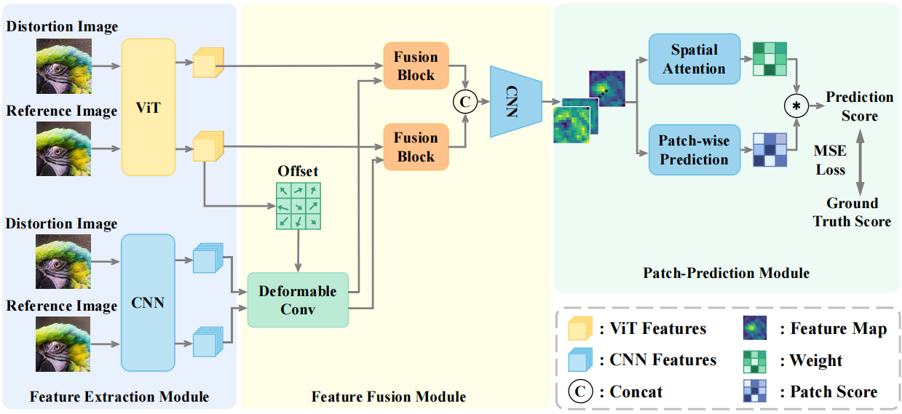

# Attention Helps CNN See Better: Hybrid Image Quality Assessment Network
[CVPRW 2022] Code for Hybrid Image Quality Assessment Network

[[paper]](https://arxiv.org/abs/2204.10485) [[code](https://github.com/IIGROUP/AHIQ)]

*This is the official repository for NTIRE2022 Perceptual Image Quality Assessment Challenge Track 1 Full-Reference competition.
**We won first place in the competition and the codes have been released now.*** 

> **Abstract:** *Image quality assessment (IQA) algorithm aims to quantify the human perception of image quality. Unfortunately, there is a performance drop when assessing the distortion images generated by generative adversarial network (GAN) with seemingly realistic texture. In this work, we conjecture that this maladaptation lies in the backbone of IQA models, where patch-level prediction methods use independent image patches as input to calculate their scores separately, but lack spatial relationship modeling among image patches. Therefore, we propose an Attention-based Hybrid Image Quality Assessment Network (AHIQ) to deal with the challenge and get better performance on the GAN-based IQA task. Firstly, we adopt a two-branch architecture, including a vision transformer (ViT) branch and a convolutional neural network (CNN) branch for feature extraction. The hybrid architecture combines interaction information among image patches captured by ViT and local texture details from CNN. To make the features from shallow CNN more focused on the visually salient region, a deformable convolution is applied with the help of semantic information from the ViT branch. Finally, we use a patch-wise score prediction module to obtain the final score. The experiments show that our model outperforms the state-of-the-art methods on four standard IQA datasets and AHIQ ranked first on the Full Reference (FR) track of the NTIRE 2022 Perceptual Image Quality Assessment Challenge.* 

## Overview
<p align="center">  </p>

## Getting Started

### Prerequisites
- Linux
- NVIDIA GPU + CUDA CuDNN
- Python 3.7

### Dependencies

We recommend running this repository using [Anaconda](https://docs.anaconda.com/anaconda/install/). All dependencies for defining the environment are provided in `requirements.txt`.

### Pretrained Models
You may manually download the pretrained models from 
[Google Drive](https://drive.google.com/drive/folders/1-8LKOEDYt-RzmM9IDV_oW73uRBLqeRB6?usp=sharing) and put them into `checkpoints/ahiq_pipal/`, or simply use 
```
sh download.sh
```

### Instruction
use `sh train.sh` or `sh test.sh` to train or test the model. You can also change the options in the `options/` as you like.

## Acknowledgment
The codes borrow heavily from IQT implemented by [anse3832](https://github.com/anse3832/IQT) and we really appreciate it.

## Citation
If you find our work or code helpful for your research, please consider to cite:
```bibtex
@article{lao2022attentions,
  title   = {Attentions Help CNNs See Better: Attention-based Hybrid Image Quality Assessment Network},
  author  = {Lao, Shanshan and Gong, Yuan and Shi, Shuwei and Yang, Sidi and Wu, Tianhe and Wang, Jiahao and Xia, Weihao and Yang, Yujiu},
  journal = {arXiv preprint arXiv:2204.10485},
  year    = {2022}
}
```
